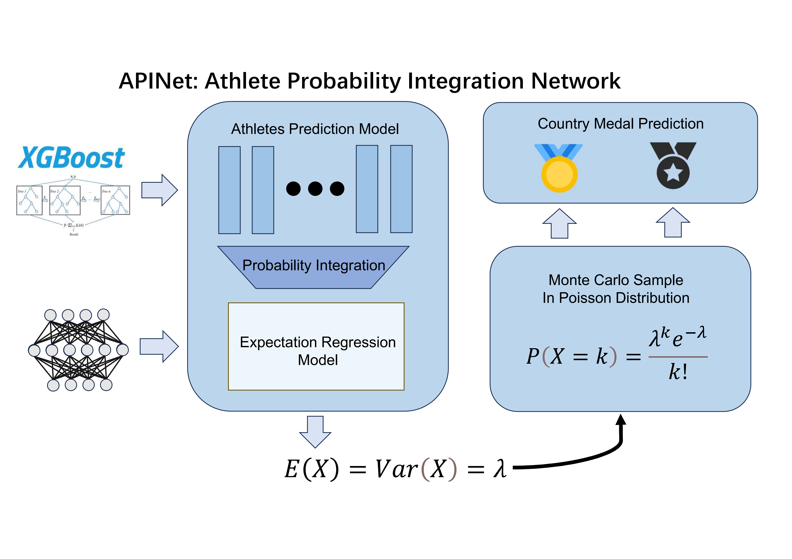

# APINet: Athletes Probability Integration Network

This repository contains the implementation of the APINet algorithm proposed in the paper "Integrating Athlete Probabilities for National Olympic Medal Forecasting," submitted for the 2025 MCM C problem.




## Abstract

随着奥运会竞争格局日益复杂，传统奖牌预测方法受限于静态历史数据和国家的宏大叙事，难以捕捉运动员的真实水平，导致预测误差形成，影响各国对于自我和他国水平的错误评估。为了更好的预测奥运会奖牌，并帮助我们发现奥运奖牌与各种因素之间的关系，我们创新地提出了一种强大的运动员概率聚合的国家奖牌预测模型和计算框架，称为APINet。

APINet本身作为一种通用有效的概率聚合计算框架，包括运动员奖牌预测模型APM，国家奖牌期望回归模型，蒙特卡洛——泊松分布采样模型，这三者结合，构成了一个国家奖牌预测模型。我们不仅根据APINet，很好地解决了对2028年奥运会的奖牌数量预测和首枚奖牌国家预测，我们还根据APINet，使用聚类等数据分析方法和因果推断，解决了项目——国家的关联问题和“伟大教练”影响问题，提出了关于奥林匹克奖牌数的原创洞见。

在建模之前，我们对以往的奥运获奖数据和运动员数据等进行了严格的筛选与数据处理，针对性地做特征工程，建立多个数据集，帮助我们训练不同的模型，同时，我们在构建APINet的计算框架的时候，将APM与期望回归模型设计为可插拔的模型，适配多种主流算法，进一步提高了APINet的通用性，在这一基础上，我们对比了不同具体算法的优劣性，选择了最优的模型。

对于APINet，我们首先建立了APM，运动员概率预测模型，从数据中训练并输出运动员可能拿奖的概率，其中XGBoost效果最好。然后我们通过对国家的每个项目的运动员的概率进行聚合，然后构建了基于概率的国家奖牌数数学期望回归模型，最后根据输出的数学期望，我们采用泊松分布进行蒙特卡洛采样，得到每一个国家的奖牌数的预测结果与预测区间。

我们预测美国是2028年奖牌数最多的国家，给出了2028年可能获得首枚奖牌的国家的个数的分布。根据APINet在训练和验证中产生的信息，综合评估了多种聚类分析的方法，采用KMeans算法，对比赛项目，国家，奖牌数量等因素进行了研究，挖掘出了三种比较典型的国家-项目-奖牌数关系，并对不同类型进行分析，给出了建议。此外，我们结合因果推断框架，通过反事实推理估计了伟大教练效应对奖牌数的因果性，对法国，印度和中国三个国家提出了建议。

总而言之，我们提出的APINet具有很好的性能，通用性与可解释性，以人为本，回归奥林匹克竞赛的本质，贴近现实，可以很好地预测未来的情况，我们旨在为更多国家和人提供有价值的建议，将奥林匹克精神传播至世界每一个角落。


## Paper

The full paper is available at [2025MCM (3).pdf](https://github.com/ArrebolBlack/MCM2025/blob/master/2025MCM%20(3).pdf).


## Installation

1. Clone the repository:
   ```bash
   git clone https://github.com/ArrebolBlack/MCM2025.git
